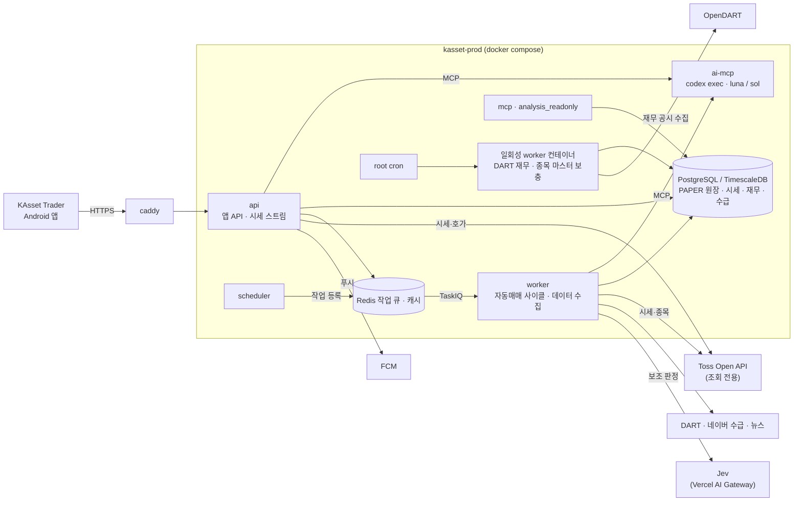

# KAsset-Trader-Core

**KAsset Trader Android 앱의 서버.** 국장(KRX) 중심의 **PAPER(모의) 자동매매**를 돌리고, 앱에 시세·관심종목·추천·주문·잔고 API를 제공합니다.

> 개인 운영 프로젝트이며 투자 조언이 아닙니다. 실계좌 주문 경로는 모두 기본 비활성(fail-closed)입니다.
> 이 저장소는 `mgh3326/auto_trader`에서 출발했지만 지금은 독립 운영됩니다. 원본의 MCP 에이전트 매매·`/invest` 대시보드·KIS·Upbit 경로는 운영에서 쓰지 않습니다.

## 무엇을 하나

- **PAPER 자동매매**: 장중 스캔 → 후보 선정 → AI 검토 → PAPER 주문 → 5단 청산 사다리(초기 손절 `진입가 − 3 ATR` 등). 현재 규칙과 근거는 [`HANDOFF.md`](HANDOFF.md).
- **Android 앱 API**: `app/extensions/kasset/api/` — 로그인(Google), 관심종목·종목 검색, 시세·차트·호가 스트림, 추천 승인/거절, PAPER 주문·체결, 푸시(FCM).
- **데이터 적재**: KR/US 일봉, 투자자 수급(네이버 모바일 API), DART 재무, 종목 마스터, 뉴스·공시.

앱 소스는 [HANSE의 `KAsset-Trader/android`](https://github.com/gim47656-ship-it/HANSE/tree/main/KAsset-Trader/android)에 있습니다. 앱 APK 빌드는 HANSE에서, 서버 테스트·배포는 이 저장소에서 관리합니다.

## 운영 구성

서버 한 대(`kasset-prod`, Tailscale)에서 `docker-compose.kasset.yml`로 돌립니다.



| 서비스 | 역할 |
|---|---|
| `api` | 앱용 FastAPI (Caddy 뒤) |
| `worker` / `scheduler` | TaskIQ 작업자와 주기 트리거 (PAPER 자동매매 사이클, 시세·데이터 수집) |
| `ai-mcp` | AI sidecar. 구독형 `codex exec`를 MCP로 감싸 앱 밖에서 LLM을 호출 |
| `mcp` | 운영 조회용 MCP 서버 |
| `db` / `redis` / `caddy` | PostgreSQL(TimescaleDB) · Redis · HTTPS 프록시 |
| `migration` | 수동 배포 때만 쓰는 Alembic 실행 프로필 |

### 브로커

| 시장 | 시세 | 주문 |
|---|---|---|
| 국장 (KRX) | Toss | KAsset PAPER (모의 원장) |
| 미국 | Toss | KAsset PAPER |

Toss 실계좌는 조회 전용입니다. 앱 주문은 PAPER로만 나갑니다. KIS는 제거됐습니다.

### AI 경로

- Codex 기반 뉴스·후보·매매 분석과 별칭 생성은 `McpStructuredJsonClient` → `ai-mcp` → `codex exec` 순서로 호출합니다. 앱 런타임에 LLM provider SDK를 직접 넣지 않는 경계를 정적 테스트로 검사합니다.
- 추론 강도별 모델: `low`(뉴스·시장·스캔) = `gpt-6-luna`, `medium`/`high`(후보 검토·매매·크리티컬) = `gpt-6-sol` (`KASSET_AI_SIDECAR_EFFORT_MODELS`).
- 뉴스 관련성·후보 가산점의 보조 판정은 별도 Jev HTTP 클라이언트가 Vercel AI Gateway를 호출합니다. Codex sidecar와 다른 경로입니다. 상세는 [`docs/kasset/AI_DUAL_PROVIDER.md`](docs/kasset/AI_DUAL_PROVIDER.md).

## 배포

```
feature branch → PR → GitHub Actions Test 통과 → squash merge → Deploy(self-hosted runner, kasset-prod) 자동
```

- `main` 직접 push는 금지입니다.
- `alembic/versions` 변경이 있으면 자동 배포가 멈춥니다(`exit 2`). 이때는 Actions → Deploy → `workflow_dispatch`에서 `allow_migration=true`로 수동 배포합니다(DB 백업 후 migration).
- 롤백과 재배포도 `workflow_dispatch`(`sha`)로 합니다.

## 수동·예약 데이터 작업

서버에서 일회성 컨테이너로 실행합니다.

```bash
cd /opt/kasset-trader-core
docker compose --env-file .env.kasset -f docker-compose.kasset.yml run --rm -T \
  -w /app -e PYTHONPATH=/app worker /app/.venv/bin/python -m scripts.<script> [...]
```

| 스크립트 | 용도 | 실행 |
|---|---|---|
| `build_financial_fundamentals_snapshots` | DART 재무 (하루 400종목, API 한도 18,000건) | root cron 매일 18:30 KST |
| `sync_symbol_master` | 원본 KR/US universe에 있지만 검색 마스터에는 없는 보통주·ETF·미국 ADR 추가 | root cron 매일 22:00 KST, 수동 실행은 `--commit` |
| `build_investor_flow_snapshots` | 투자자 수급 백필 | 수동 |
| `backfill_daily_candles` | 일봉 백필 | 수동 |
| `generate_symbol_search_aliases` | AI 검색 별칭 (sidecar `low`) | 수동 (`--commit`) |
| `kasset_strategy_validation` | 전략 검증 보고서 (DB 읽기 전용) | 수동 (`--output`) |

`sync_symbol_master`와 AI 별칭 CLI는 기본 dry-run이며 `--commit`일 때 저장합니다. 나머지 수집기는 각 `--help`의 쓰기 옵션을 확인하세요. 새 스케줄 등록은 운영자 승인이 필요합니다.

종목 동기화는 기존 `kr_symbol_universe`·`us_symbol_universe`에서 `symbol_master`로 **누락 행만** 보충합니다. 기존 이름 수정·상장폐지 반영·우선주 추가는 하지 않습니다. 원본 universe 수집과 검색 마스터 보충은 별개의 단계입니다.

- 실행 파일: `/usr/local/bin/kasset-symbol-master-daily.sh`
- 예약: `0 22 * * * /usr/local/bin/kasset-symbol-master-daily.sh >> /var/log/kasset-symbol-master-daily.log 2>&1`
- 중복 실행 방지: `/run/kasset-symbol-master-daily.lock`에 `flock`
- 점검: `crontab -l`, `systemctl is-active crond`, `/var/log/kasset-symbol-master-daily.log`
- 복구: 원본 수집 상태를 확인한 뒤 위 일회성 컨테이너 명령으로 `scripts.sync_symbol_master --commit`을 실행합니다. 중복 키는 추가하지 않습니다.

## 개발 규칙 (요약)

정본은 [`CLAUDE.md`](CLAUDE.md)이고, 에이전트용 요약은 [`AGENTS.md`](AGENTS.md)입니다.

- **테스트·lint는 로컬에서 돌리지 않습니다.** 기본 검증 경로는 GitHub Actions입니다(`ruff` + `ty` + pytest 4 shard, TaskIQ smoke, migration round-trip). 새 테스트 파일은 `ci_shards/shard-N.txt` 한 곳에 정렬 위치로 추가합니다.
- 새 테이블이나 제약을 바꾸는 마이그레이션은 migration round-trip 테스트의 post-boundary 목록과 `tests/_schema_bootstrap.py` 버전도 함께 갱신합니다.
- 주문 레저 직접 쓰기, 게이트 완화, 스케줄 무단 등록은 금지입니다.
- 심볼 변환은 `app/core/symbol.py`만 사용합니다.

## 문서

- 현재 운영 상태와 다음 행동: [`HANDOFF.md`](HANDOFF.md)
- 작업 기록: [`doc/history/`](doc/history/)
- KAsset 설계: [`docs/kasset/`](docs/kasset/) — AI 경로, 자동매매 돌파 계약, Core 통합 지도
- 런북: [`docs/runbooks/`](docs/runbooks/)
