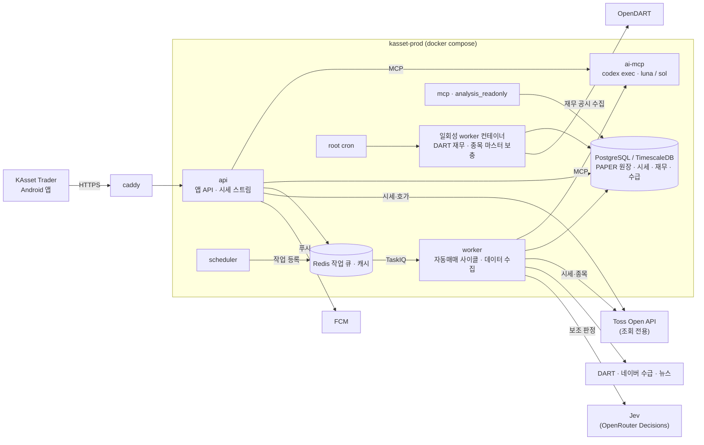

# KAsset-Trader-Core

**KAsset Trader Android 앱의 서버.** 국장(KRX) 중심의 **PAPER(모의) 자동매매**를 돌리고, 앱에 시세·관심종목·추천·주문·잔고 API를 제공합니다.

> 개인 운영 프로젝트이며 투자 조언이 아닙니다. 실계좌 주문 경로는 모두 기본 비활성(fail-closed)입니다.
> 이 저장소는 `mgh3326/auto_trader`에서 출발했지만 지금은 독립 운영됩니다. 원본의 MCP 에이전트 매매·`/invest` 대시보드·KIS·Upbit 경로는 운영에서 쓰지 않습니다.

## 무엇을 하나

- **PAPER 자동매매**: 장중 스캔 → 후보 선정 → AI 검토 → PAPER 주문 → 5단 청산 사다리(초기 손절 `진입가 − 2 ATR` 등). 현재 규칙과 근거는 [`HANDOFF.md`](HANDOFF.md).
- **Android 앱 API**: `app/extensions/kasset/api/` — 로그인(Google), 관심종목·종목 검색, 시세·차트·호가 스트림, 추천 승인/거절, PAPER 주문·체결, 푸시(FCM).
- **데이터 적재**: KR/US 일봉, 투자자 수급(네이버 모바일 API), DART 재무, 종목 마스터, 뉴스·공시.

앱 소스와 APK 빌드는 별도 앱 저장소에서 관리합니다. 이 저장소는 서버 테스트·배포를 담당합니다.

## 운영 구성

서버 한 대(`kasset-prod`, Tailscale)에서 `docker-compose.kasset.yml`로 돌립니다.


```mermaid
flowchart LR
    APP["KAsset Trader<br/>Android 앱"] -->|HTTPS| CADDY["caddy"]
    CADDY --> API["api<br/>앱 API · 시세 스트림"]

    subgraph Server["kasset-prod (docker compose)"]
        API
        SCHED["scheduler"] -->|작업 등록| REDIS[("Redis 작업 큐 · 캐시")]
        REDIS -->|TaskIQ| WORKER["worker<br/>자동매매 사이클 · 데이터 수집"]
        WORKER -->|MCP| AIMCP["ai-mcp<br/>codex exec · luna / sol"]
        API -->|MCP| AIMCP
        API --> DB[("PostgreSQL / TimescaleDB<br/>PAPER 원장 · 시세 · 재무 · 수급")]
        WORKER --> DB
        API --> REDIS
        MCP["mcp · analysis_readonly"] --> DB
        CRON["root cron"] --> JOB["일회성 worker 컨테이너<br/>DART 재무 · 종목 마스터 보충"]
        JOB --> DB
    end

    WORKER -->|시세·종목| TOSS["Toss Open API<br/>(조회 전용)"]
    API -->|시세·호가| TOSS
    WORKER --> EXT["DART · 네이버 수급 · 뉴스"]
    JOB -->|재무 공시 수집| DART["OpenDART"]
    WORKER -->|보조 판정| JEV["Jev<br/>(OpenRouter Decisions)"]
    API -->|푸시| FCM["FCM"]
```

| 서비스 | 역할 |
|---|---|
| `api` | 앱용 FastAPI (Caddy 뒤) |
| `worker` / `scheduler` | TaskIQ 작업자와 주기 트리거 (PAPER 자동매매 사이클, 시세·데이터 수집) |
| `ai-mcp` | AI sidecar. 구독형 `codex exec`를 MCP로 감싸 앱 밖에서 LLM을 호출 |
| `mcp` | 운영 조회용 MCP 서버 |
| `db` / `redis` / `caddy` | PostgreSQL(TimescaleDB) · Redis · HTTPS 프록시 |
| `migration` | 수동 배포 때만 쓰는 Alembic 실행 프로필 |

### 브로커

| 시장 | 시세 | 주문 |
|---|---|---|
| 국장 (KRX) | Toss | KAsset PAPER (모의 원장) |
| 미국 | Toss | KAsset PAPER |

Toss 실계좌는 조회 전용입니다. 앱 주문은 PAPER로만 나갑니다. KIS는 제거됐습니다.

### AI 경로

- Codex 기반 뉴스·후보·매매 분석과 별칭 생성은 `McpStructuredJsonClient` → `ai-mcp` → `codex exec` 순서로 호출합니다. 앱 런타임에 LLM provider SDK를 직접 넣지 않는 경계를 정적 테스트로 검사합니다.
- 추론 강도별 모델: `low`(뉴스·시장·스캔) = `gpt-6-luna`, `medium`/`high`(후보 검토·매매·크리티컬) = `gpt-6-sol` (`KASSET_AI_SIDECAR_EFFORT_MODELS`).
- 뉴스 관련성·후보 가산점의 보조 판정은 별도 Jev HTTP 클라이언트가 OpenRouter Decisions API(`typesafe/jev-1.13`)를 호출합니다. Codex sidecar와 다른 경로입니다. 상세는 [`docs/kasset/AI_DUAL_PROVIDER.md`](docs/kasset/AI_DUAL_PROVIDER.md).

## 배포

```
feature branch → PR → GitHub Actions Test 통과 → squash merge → Deploy(self-hosted runner, kasset-prod) 자동
```

- `main` 직접 push는 금지입니다.
- `alembic/versions` 변경이 있으면 자동 배포가 멈춥니다(`exit 2`). 이때는 Actions → Deploy → `workflow_dispatch`에서 `allow_migration=true`로 수동 배포합니다(DB 백업 후 migration).
- 롤백과 재배포도 `workflow_dispatch`(`sha`)로 합니다.

### CUELO 클라우드 수동 교체

같은 서버의 별도 스택(Compose project `cuelo-cloud`, 파일 `/opt/cuelo/compose.yaml`, 서비스 `cuelo`)인 CUELO를 교체하는 수동 workflow `CUELO Cloud`(`.github/workflows/cuelo-cloud.yml`, `deploy/cuelo/host.sh`)입니다. KAsset Deploy와 별개이며 KAsset app·DB·컨테이너·`deploy/kasset`을 건드리지 않습니다. `workflow_dispatch`만 있고 자동 트리거·스케줄은 없습니다.

입력은 `mode`(`inspect` 기본 / `deploy` / `images` / `cleanup-images`), 공개 CUELO commit의 40자 전체 `cuelo_sha`(`inspect`·`deploy`만 필수), `expected_version`, `expected_core`, 이미지 정리용 `cleanup_image_ids`·`apply_cleanup`(기본 꺼짐), 기본 꺼짐인 `grant_runner_access`입니다. 사용자 권한 승인 뒤 `inspect`에만 `grant_runner_access=true`를 주면 기존 이미지의 격리된 Linux helper로 runner의 이름 있는 ACL을 추가합니다: 운영 폴더는 읽기·탐색, `compose.yaml`·`.env`는 읽기만, `/opt/cuelo/deploy`는 runner 전용 쓰기입니다. 기존 ACL과 충돌하면 중단하며 인증·대화·작업 폴더 권한을 재귀 변경하지 않습니다. 임의 경로·저장소·명령 입력은 없습니다.

1. **`inspect` 먼저.** ubuntu에서 그 commit이 공개 `main`의 조상이고 `package.json`이 기대 버전·core와 같은지 확인하고, 운영 서버(`self-hosted, kasset-prod`)에서 읽기 전용으로 Docker·`/opt/cuelo` 접근권한(내용은 읽지 않음), 현재 이미지·mount·사용자·health·버전, 프로필 존재와 `modelRoles` 해시를 출력합니다. 문제가 하나라도 있으면 실패하며, `deploy`도 같은 조건에서 교체 전에 멈춥니다. 권한은 자동으로 바꾸지 않습니다.
2. **`deploy`.** ubuntu-latest에서 공개 commit을 기존 Dockerfile(UID/GID 1000)로 build하고 이미지 안에서 package·core 버전, `native-runtime-patch --check`, `prepare-runtime --check`를 검사한 뒤 Actions artifact(보존 1일)로 넘깁니다. 운영 서버는 build하지 않고 `docker load`만 합니다. 이미지가 준비될 때까지 기존 CUELO는 계속 돕니다.
3. 교체 순서: 이미지 ID 대조 → `compose.image.yaml`(image 한 줄) 후보를 만들어 `compose config` 차이가 image 줄뿐인지 확인 → 기존 컨테이너 안에서 `lib/update-interrupt.ts`의 drain 파일 계약(`request.json`, `excludeSessionIds` 없음)으로 세션을 abort·child 정리하고 `pending-resume.json`에 기록 → `ack`의 `unsettled`·`failed`가 0이 아니거나 40초 안에 ack가 없으면 교체 전 실패 → 이전 이미지에 `cuelo-cloud-rollback:<run>` 태그를 붙이고 이전 override를 `.prev-<run>`으로 보존 → `up -d --no-deps --no-build --pull never cuelo`. 현재 세션도 `pending-resume.json`에 기록되지만 자동 재개는 보장하지 않습니다(아래 제한 참고).
4. 교체 뒤 확인: `install.mjs health` 4개 OK, Docker health `healthy`, 실행 중 package·core 버전, mount·사용자 동일, 프로필(`config.yml`·`agent.db` 존재, `modelRoles` 해시) 동일, Compose 라벨에 override 포함. 결과(값 없이)는 컨테이너가 재기동돼도 Actions 실행 요약과 로그에 남습니다.
5. **이미지 정리(`images` → `cleanup-images`, 수동).** `images`는 읽기 전용으로 CUELO 범위(`cuelo-cloud:*`·`cuelo-cloud-rollback:*`·`cuelo:cloud-*`) 이미지마다 전체 ID·태그 전체·생성 시각·size·참조 컨테이너와 `PROTECT`/`CANDIDATE` 이유를 출력하고, `docker system df` Images 행과 Docker 저장소 여유를 보입니다. 이 두 모드는 공개 commit 확인·build 없이 host job만 돕니다. `cleanup-images`는 `cleanup_image_ids`에 `images`의 CANDIDATE 전체 ID(`sha256:64hex`, 최대 20개)를 넣어야 하고, `apply_cleanup`이 꺼져 있으면(기본) 판정과 계획(이미지별로 지울 태그 전체)만 출력하는 dry-run입니다. `apply_cleanup=true`일 때만 지우며, 이미지마다 삭제 직전에 Docker 상태를 다시 읽어 참조·보호·태그 변화를 재확인합니다.

범위와 제한:

- 이미지 지정은 `/opt/cuelo/deploy/compose.image.yaml`(+ 재교체 때 `.prev-<run>` 복사본)에만 씁니다. `compose.yaml`·`.env`·`config.yml`·인증 DB·`APPEND_SYSTEM.md` 내용은 수정하지 않습니다. 권한 설정은 별도 명시 입력에서만 실행하며 일반 inspect/deploy는 권한을 바꾸지 않습니다.
- inspect·deploy에는 `down`·`rm`·`prune`·볼륨 삭제와 자동 rollback이 없습니다. 실패하면 복구 근거(이전 이미지 태그·이전 override)와 수동 명령을 로그에 남기고 멈춥니다. 이미지 정리는 사용자 승인 뒤 위 `cleanup-images`로만 하고, artifact 정리는 별도 승인 후 수동으로 합니다.
- 이미지 정리가 지키는 것: 현재 cuelo 컨테이너의 이미지, 최신 `cuelo-cloud-rollback:<run>-<attempt>`(run 번호 최대) 이미지, 모든 상태(중지 포함) 컨테이너가 참조하는 이미지, override가 가리키는 이미지, 직전 복구 이미지보다 새로 만든 이미지, 형식이 다른 rollback 태그, 다른 repository나 `<none>` 항목이 같은 ID를 가리키는 이미지는 삭제를 거부합니다. 현재 컨테이너나 복구 태그를 못 찾아 기준을 세울 수 없어도 모두 거부합니다. 요청 ID 중 하나라도 거부되면 아무것도 지우지 않습니다(all-or-nothing). 삭제 중 상태가 어긋나거나 `docker image rm`이 실패하면 그 자리에서 멈추고 receipt(삭제·실패·미시도)를 남깁니다.
- 삭제는 이미지의 CUELO 태그를 하나씩 `docker image rm <tag>`로 지울 뿐이며 `-f`·`prune`·컨테이너·볼륨·빌드 캐시 삭제나 재시작은 없습니다. 이미지별 size는 공유 레이어를 중복 포함하므로 합산해도 회수량이 아니고, 실제 변화는 삭제 전후 `docker system df`·저장소 여유 로그로만 봅니다. `compose.yaml`의 기본 image 이름이 후보 태그면 inventory가 알려 주며, 지우면 override 없이 `compose.yaml`만 쓰는 수동 실행이 그 이름을 찾지 못합니다. 자동 deploy 뒤에 이어 실행되지 않습니다.
- 이후 수동 `docker compose`는 `-f /opt/cuelo/compose.yaml -f /opt/cuelo/deploy/compose.image.yaml`을 함께 써야 새 이미지가 유지됩니다(`compose.yaml`만 쓰면 이전 image로 되돌아갑니다).
- 교체 중에는 CUELO가 재시작되어 진행 중이던 세션이 중단됩니다. 로그의 재개 대기열 `pending` 건수는 파일에서 읽은 관측값일 뿐입니다. 서버는 대기열을 쓴 프로세스의 PID가 새 프로세스와 같으면(컨테이너 PID 재사용) 그 대기열을 재개하지 않으므로 자동 재개를 보장하지 않습니다. 새 컨테이너에서 대화를 직접 이어 가며, 배포 결과는 이 Actions 실행의 요약·로그로 확인합니다.
- `cancel-in-progress: false`인 전용 concurrency 그룹 `cuelo-cloud-deploy`로 host job끼리 직렬화합니다. KAsset의 `production-deploy` 그룹과 공유하지 않으며 같은 runner 슬롯에서는 KAsset 배포와 번갈아 실행됩니다.

## 수동·예약 데이터 작업

서버에서 일회성 컨테이너로 실행합니다.

```bash
cd /opt/kasset-trader-core
docker compose --env-file .env.kasset -f docker-compose.kasset.yml run --rm -T \
  -w /app -e PYTHONPATH=/app worker /app/.venv/bin/python -m scripts.<script> [...]
```

| 스크립트 | 용도 | 실행 |
|---|---|---|
| `build_financial_fundamentals_snapshots` | DART 재무 지속 갱신 (최악 요청 수로 일일 18,000건 안에서 대상 선정) | root cron 매일 18:30 KST (`kasset-dart-daily.sh` 2단계) |
| `app.jobs.dart_disclosure_ingestion` (`-m`으로 실행) | DART 공시 목록 → `news_articles`(`feed_source=dart`), 최근 N일 upsert | root cron 매일 18:30 KST (`kasset-dart-daily.sh` 1단계, `--recent-days 2`) · 백필은 `--from-date`/`--to-date` |
| `sync_symbol_master` | 원본 KR/US universe에 있지만 검색 마스터에는 없는 보통주·ETF·미국 ADR 추가 | root cron 매일 22:00 KST, 수동 실행은 `--commit` |
| `build_investor_flow_snapshots` | 국장 전체 종목 최근 20일 수급 보충 | 승인 후 TaskIQ 월~토 08:30 KST (`investor_flow_snapshots.kr_scheduled`), 수동 백필도 가능 |
| `backfill_daily_candles` | 일봉 백필 | 수동 |
| `generate_symbol_search_aliases` | AI 검색 별칭 (sidecar `low`) | 수동 (`--commit`) |
| `kasset_strategy_validation` | 전략 검증 보고서 (DB 읽기 전용) | 수동 (`--output`) |
| `kasset_exit_rule_comparison` | 기준 백테스트의 진입을 고정하고 사전 고정 청산 변형(`PRESET_EXIT_VARIANTS`)만 비교. KRX 매도세·하한가 잠김 이월·체결 봉 거래량 1% 상한 반영, 끝까지 청산되지 않은 진입은 모든 변형에서 제외 (DB 읽기 전용) | 수동 (`--variants`, `--signal-start-at`·`--end-at`) |
| `kasset_swing_shadow` | KRX 스윙 3후보의 주문 없는 관측·가상 성과 조회 | `observe`는 저장, `report --since YYYY-MM-DD --signals`는 읽기 전용. 승인·마이그레이션 후 활성화하면 기존 평일 16:30 일봉 수집 성공 뒤 관측 |

`sync_symbol_master`와 AI 별칭 CLI는 기본 dry-run이며 `--commit`일 때 저장합니다. 나머지 수집기는 각 `--help`의 쓰기 옵션을 확인하세요. 새 스케줄 등록은 운영자 승인이 필요합니다.

스윙 SHADOW의 판정 규칙·활성화 순서·2주 성적 조회 방법은 [스윙 SHADOW 런북](docs/runbooks/kasset-swing-shadow.md)에 있습니다. 기본 off이며 단기 매매·주문·승격에는 연결하지 않습니다. 성과는 다음 거래일 시가 가상 진입에 대한 거래일별 관찰값으로, 실제 체결·계좌 수익이 아닙니다.

장기 추세·재무성장 SHADOW의 규칙·코호트 성과·벤치마크 해석은 [장기 SHADOW 런북](docs/runbooks/kasset-longterm-shadow.md)에 있습니다. 기본 off이며 주문·추천·승격에 연결하지 않습니다.

종목 동기화는 기존 `kr_symbol_universe`·`us_symbol_universe`에서 `symbol_master`로 **누락 행만** 보충합니다. 기존 이름 수정·상장폐지 반영·우선주 추가는 하지 않습니다. 원본 universe 수집과 검색 마스터 보충은 별개의 단계입니다.

- 실행 파일: `/usr/local/bin/kasset-symbol-master-daily.sh`
- 예약: `0 22 * * * /usr/local/bin/kasset-symbol-master-daily.sh >> /var/log/kasset-symbol-master-daily.log 2>&1`
- 중복 실행 방지: `/run/kasset-symbol-master-daily.lock`에 `flock`
- 점검: `crontab -l`, `systemctl is-active crond`, `/var/log/kasset-symbol-master-daily.log`
- 복구: 원본 수집 상태를 확인한 뒤 위 일회성 컨테이너 명령으로 `scripts.sync_symbol_master --commit`을 실행합니다. 중복 키는 추가하지 않습니다.

DART 일일 작업은 공시 목록 수집을 먼저 돌리고 재무 지속 갱신을 이어서 돌립니다. 2026-10-04~10-08에 재무 대량 수집 직후의 공시 `list.json` 요청이 `ReadError`로 연속 실패해서 2026-10-09에 순서를 바꿨습니다. 두 단계는 같은 `OPENDART_API_KEY` 하루 한도(20,000건)를 나눠 쓰며, 재무 자체 상한 18,000건을 유지합니다.

- 실행 파일: `/usr/local/bin/kasset-dart-daily.sh` (이전 판 `/root/kasset-dart-daily.sh.pre-order-swap-20261009075456`)
- 예약: `30 18 * * * /usr/local/bin/kasset-dart-daily.sh >> /var/log/kasset-dart-daily.log 2>&1`
- 중복 실행 방지: 스크립트 전체를 `/run/kasset-dart-daily.lock`에 `flock`. 공시 단계가 실패해도 재무 단계는 실행됩니다.
- 점검: 로그의 `fundamentals exit=`·`disclosures exit=` 줄, `news_ingestion_runs`의 `feed_set=dart` 행
- 공시 백필: 한 번에 여러 달을 넣지 말고 하루씩 나눠 실행합니다. 공시 목록만 받는 경우 약 100건당 1요청입니다.

재무 cron의 수집 명령은 승인 후 아래 지속 갱신 모드로 바꿉니다.
기존 `--skip-existing`은 최초 백필 전용이며 한 행이라도 저장된 종목을 다시 받지 않으므로 지속 갱신에 쓰지 않습니다.

```bash
python -m scripts.build_financial_fundamentals_snapshots \
  --with-quarterly --refresh-due --all --commit --allow-partial
```

- 과거 5개 완료 회계연도와 올해 이미 끝난 분기를 대상으로 합니다. 법정 제출기한 전 조기 공시도 받을 수 있으며, 미종료 기간은 요청하지 않고 미공시 기간의 가짜 행을 만들지 않습니다.
- 기존 종목의 최신 기간 누락·부분 자료는 7일 후 재확인 대상, 정정 확인은 30일 후 대상이 됩니다. 대상 수와 예산 때문에 실제 갱신은 여러 날에 나뉠 수 있습니다. 성공한 수집 근거 없이 갱신시각을 만들지 않습니다.
- 자동 대상은 종목 마스터의 보통주 구분을 사용해 ETF·우선주 등을 제외합니다. 명시적 `--symbol` 수동 조회는 별개입니다.
- `--all`도 요청 예산을 넘기지 않도록 나눠 선정하며, 결과의 `projected_requests`·선정 사유·이월 종목 수를 확인합니다.
- 먼저 같은 옵션에 `--estimate-only`를 사용하면 외부 DART 호출·DB 저장 없이 선정 대상을 확인할 수 있습니다(`--commit`과 함께 사용하지 않음). `--dry-run` 기본 동작은 DB에 저장하지 않을 뿐 실제 DART 요청 예산을 소비합니다.
- 요청 카운터는 수집 프로세스 단위입니다. 같은 날 전체 재무 작업을 수동으로 반복하면 다른 프로세스·공시 수집과 사용량이 합산되지 않으므로, 운영 일일 실행과 중복하지 않습니다. 배포 직후의 소수 종목 확인도 공시용 여유분 안에서 별도로 제한합니다.
- 종료 코드는 정상·무대상 `0`, 예산 소진으로 무저장 `3`, 선택한 모든 종목이 실패하거나 빈 응답으로 끝나 무저장 `4`입니다. 일부 종목 실패를 허용한 실행은 경고와 실제 적재 범위를 함께 확인합니다.

### 수급 지속 갱신

기존 TaskIQ 예약을 사용하며 별도 root cron을 추가하지 않습니다. `.env.kasset`의
`INVESTOR_FLOW_SCHEDULE_ENABLED=true`는 예약 등록,
`INVESTOR_FLOW_SNAPSHOTS_COMMIT_ENABLED=true`는 DB 저장을 각각 허용합니다.
둘 다 기본값은 `false`입니다. 승인 후 값을 변경하고 worker·scheduler를 재생성해야
import 시점의 예약 라벨과 실행 설정에 반영됩니다.

- 월~토 08:30 KST에 오늘 또는 전일이 KRX 거래일이면 전체 active KR universe의 최근 20일을 upsert합니다. 금요일 자료는 토요일에도 수집 기회를 얻습니다.
- 실제 Naver 공표가 늦으면 해당 run에 최신 행이 없을 수 있습니다. 이후 run의 20일 보충이 결손을 다시 채우므로, 성공 종료뿐 아니라 `snapshot_date`별 종목 수를 확인합니다.
- 작업 결과의 `symbolsWithRows`와 `status=ok/partial/failed`를 확인합니다. 일부·전체 누락은 경고·오류 로그로 남기며, 이 결과로 자동 재시도를 추가하지 않습니다.
- 기존 16:40 `kasset.market_snapshots.kr.sync`는 보유·관심·추천 종목용이며, 전체 수급 갱신을 대신하지 않습니다.
- 초기 누락 보충은 위 일회성 컨테이너에서 `scripts.build_investor_flow_snapshots --market kr --all --days 20 --batch-size 100 --commit`을 실행합니다. 1년 백필은 `--days 250 --batch-size 25`로 DB 바인드 인자 한도를 피합니다.

## 개발 규칙 (요약)

정본은 [`CLAUDE.md`](CLAUDE.md)이고, 에이전트용 요약은 [`AGENTS.md`](AGENTS.md)입니다.

- **테스트·lint는 로컬에서 돌리지 않습니다.** 기본 검증 경로는 GitHub Actions입니다(`ruff` + `ty` + pytest 4 shard, TaskIQ smoke, migration round-trip). 새 테스트 파일은 `ci_shards/shard-N.txt` 한 곳에 정렬 위치로 추가합니다.
- 새 테이블이나 제약을 바꾸는 마이그레이션은 migration round-trip 테스트의 post-boundary 목록과 `tests/_schema_bootstrap.py` 버전도 함께 갱신합니다.
- 주문 레저 직접 쓰기, 게이트 완화, 스케줄 무단 등록은 금지입니다.
- 심볼 변환은 `app/core/symbol.py`만 사용합니다.

## 문서

- 현재 운영 상태와 다음 행동: [`HANDOFF.md`](HANDOFF.md)
- 작업 기록: [`doc/history/`](doc/history/)
- KAsset 설계: [`docs/kasset/`](docs/kasset/) — AI 경로, 자동매매 돌파 계약, Core 통합 지도
- 런북: [`docs/runbooks/`](docs/runbooks/)
